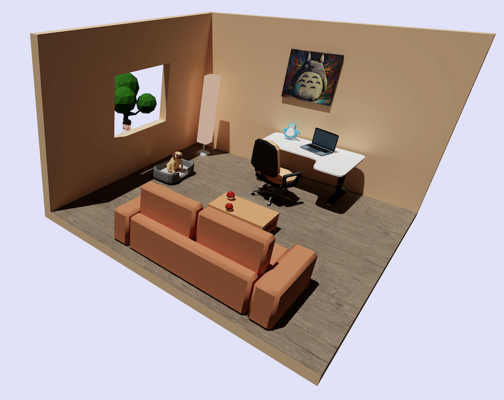

# [My 3D Portfolio](https://mingchao-zhang.github.io/Portfolio/)

## Motivation

The other day, I was randomly looking through my starred repositories on GitHub. There were many cool projects I wanted to work on, but all I did eventually was just to star them 🤣. When I came across the three.js repository and saw the incredible [demos](https://threejs.org/), I thought to myself: I gotta do at least one cool project with three.js. This is where the journey of this 3D website starts.

## Development

To get started, I learned the fundamentals of three.js through Bruno Simon's course [here](https://threejs-journey.com/#). As I watched more of his videos, I realized that these 3D objects are not created from code directly. Instead, I need to first model them in [Blender](https://www.blender.org/) and then import them with JavaScript code. So the next step is to learn Blender which doesn't require writing any code, but has quite a steep learning curve.

After watching a couple of introduction videos and memorizing dozens of keyboard shortcuts in Blender, I was able to move and create shapes and import external models. Next comes the most difficult part: texture baking. Any 3D model consists of two essential parts: shape and texture (color). The browser needs some way to know how to map the texture onto the 3D model so that the model is colorful instead of just having grayscale. The process of creating the texture and storing it in a JPEG file is called texture baking.

With hindsight, texture baking is all about selecting an object, UV unwrapping faces, and cleverly rearranging and scaling unwrapped faces to maximize the final texture quality. However, it was just really difficult when I didn't know how to do it. I almost gave up after not knowing why some 3D models kept having very low-resolution textures. After dozens of tries and a lot of messing around, I finally got my living room model to render properly. Whew! 

The rest of the project (animation, deployment, and positioning) is definitely not trivial, but having gone through the grinding test of texture baking, nothing can stop me at this point, haha.

## Conclusion

After actively working on a front-end project like this one over the span of a month, I am excited about the future of 3D website development and genuinely humbled by the various challenges front-end developers face day to day. Never will I naively say: "That's easy because it's front-end" 😅.

## East egg

Sitting behind the window by the tree is me daydreaming :)
